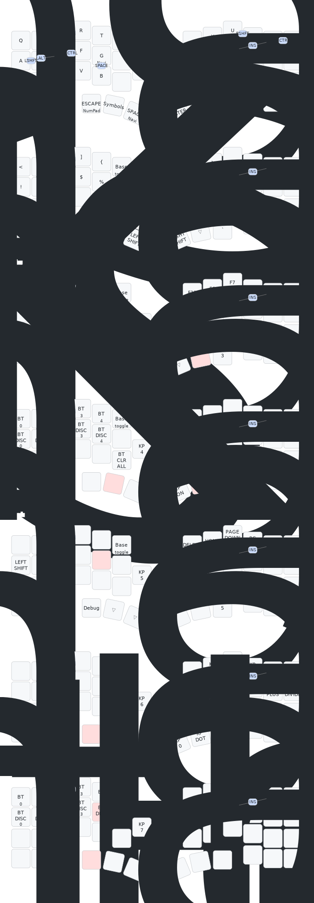

# zmk-config

[Cornix LP](https://github.com/hitsmaxft/zmk-keyboard-cornix) 分割キーボード（ロータリーエンコーダ付き）の ZMK ファームウェア設定です。標準ファームウェア (RMK) との違いは [なぜ ZMK？](docs/why-zmk.ja.md) を参照してください。

[English](README.md)

## 設計

このキーマップは **コンボ中心設計**です。ホームロウ Mods (HM) は採用せず、修飾キー (Shift / Ctrl / Alt / GUI) はすべてコンボでアクセスします。USB 経由のライブ編集に対応する **ZMK Studio** ファームウェアとしてビルドされます。

詳細は以下を参照：
- [コンボリファレンス](docs/combos.ja.md)
- [設定リファレンス](docs/configuration.ja.md)
- [キーマップ設計ログ](docs/keymap-design.ja.md) — 設計判断の経緯

## キーマップ

## ビルド

GitHub に push すると自動で GitHub Actions がビルドを実行します。
[最新の Actions ラン](https://github.com/LevNas/zmk-config/actions) から `.uf2` ファイルをダウンロードできます。

### フラッシュ方法

1. キーボード半分を UF2 ブートローダーモードにする (リセットボタンをダブルタップ)
2. 左側に `cornix_left.uf2`、右側に `cornix_right.uf2` をコピー
3. 別のファームウェアから切り替える場合は、先に両側に `reset.uf2` をフラッシュして BT ボンディング情報をクリア

### ZMK Studio (ライブ編集)

フラッシュ後、**左半身**を USB ケーブルで PC に接続し、Chrome または Edge で <https://zmk.studio/> を開くとライブで keymap を編集できます。
注意: Studio は振る舞い定義 (mod-morph / レイヤータップ / エンコーダマッピング) は編集できません。それらはソース編集 + 再ビルドが必要です。

## カスタマイズ

自分のキーマップを作りたい場合は、GitHub で **「Use this template」** をクリックしてリポジトリを作成してください。詳しくは [セットアップガイド](docs/fork-guide.ja.md) を参照。

## ハードウェア

- ボード: Cornix LP (分割、nRF52840)
- ロータリーエンコーダ: 2 個 (左: 音量 / 右: Page Up・Down (Base レイヤー時)、レイヤー別の上書きあり)
- ドングルなし

## 謝辞

- [hitsmaxft](https://github.com/hitsmaxft) — [Cornix LP](https://github.com/hitsmaxft/zmk-keyboard-cornix) のボード設計と ZMK ボード定義
- [urob](https://github.com/urob) — [zmk-helpers](https://github.com/urob/zmk-helpers) マクロ (DTS 記述簡略化に利用。HM は本構成では採用していません)
- [ZMK Contributors](https://zmk.dev/) — ZMK ファームウェアと ZMK Studio
